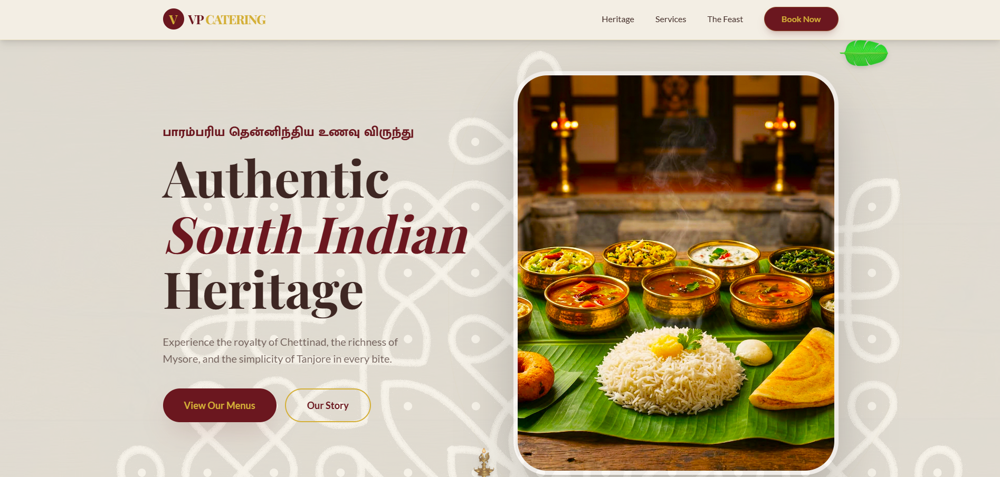
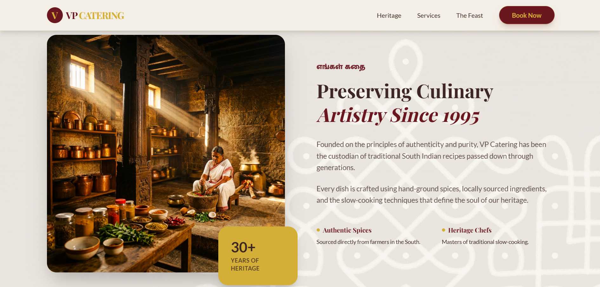
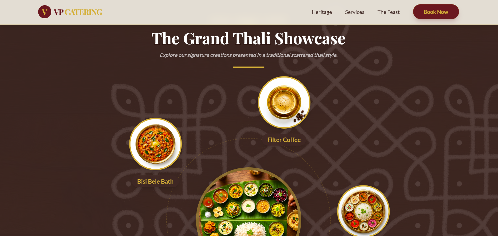
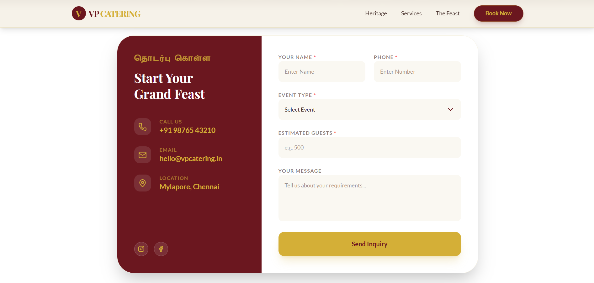

# Dreams Catering — Premium South Indian Heritage

A production-ready, highly engaging landing page for a premium South Indian catering service. This project blends traditional heritage aesthetics with modern frontend elegance, featuring fluid animations and a rich, cultural design system.



## Design Philosophy

The interface is built on a "Traditional Modernism" aesthetic—capturing the warmth of South Indian hospitality through a curated palette and motion language.

*   **Primary Palette:** Deep Maroon (`#6B171F`) & Rich Gold (`#D4AF37`)
*   **Background:** Warm Parchment Beige (`#F5F1E7`)
*   **Typography:** Elegant Serifs (Playfair Display) for heritage headings, clean Sans-Serifs (Lato) for legibility, and traditional Tamil (Mukta Malar) accents.

## Technical Highlights

*   **Tailwind CSS v4.0:** Utilizing the latest engine for lightning-fast styling and native CSS-variable-driven theming.
*   **Framer Motion:** Implemented for high-end interactions:
    *   **Staggered Entry:** Sections slide and fade into view on scroll.
    *   **Dynamic Floating:** Infographic elements (Banana Leaf, Brass Lamp) utilize subtle Y-axis oscillations for a "living" feel.
    *   **Circular Showcase:** A unique, scattered Thali layout for menu items with orbiting motion.
*   **Vite 6 Ecosystem:** Optimized build pipeline for maximum performance and instant HMR.

## Visual Showcase

*Screenshots will be populated as assets are generated.*

| Section | Preview |
| :--- | :--- |
| **Hero** |  |
| **About** |  |
| **Menu Showcase** |  |
| **Contact Form** |  |

## 🛠️ Installation & Setup

1.  **Clone the Repository:**
    ```bash
    git clone https://github.com/vigneshpraveen-official/south-indian-catering.git
    cd south-indian-catering
    ```

2.  **Install Dependencies:**
    ```bash
    npm install
    ```

3.  **Run Development Server:**
    ```bash
    npm run dev
    ```

## The Essence of Dreams Catering

Every line of code and every design choice in this project is dedicated to one goal: honoring the heritage of South Indian hospitality. From the golden hues of our palette to the rhythmic motion of our transitions, we invite you to experience a digital feast as rich as our history.

---

Crafted with precision and a passion for South Indian Culinary Arts.
